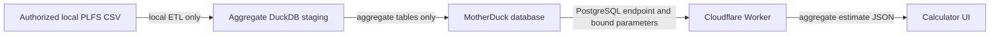

## Context

The application currently queries a 56 MB local DuckDB database containing
aggregate PLFS cells, variance sufficient statistics, source metadata, and
validation diagnostics. The authorized person-level CSV is an ETL input only
and is not persisted in the serving database. Cloudflare Workers cannot load
the native DuckDB Node binding, while MotherDuck exposes the same database
through a PostgreSQL-compatible endpoint supported in Workers.

The hosted application must remain statistically identical to the local
PLFS-backed preview. Hosting does not resolve the pending NFHS height model or
the PLFS usage-scope review.

## Goals / Non-Goals

**Goals:**

- Make the calculator available at the requested custom domain.
- Preserve all joint-filter and exact-income behavior from the local database.
- Keep raw microdata off MotherDuck, Git, Cloudflare, and public APIs.
- Keep credentials revocable, untracked, and injected only as runtime secrets.
- Prove local-to-hosted parity with schema, row-count, and representative-query
  checks before deployment.

**Non-Goals:**

- Importing NFHS-5 or enabling height.
- Reclassifying the product as fully survey-backed.
- Publishing or exposing source records.
- Compacting or coarsening the serving cube.
- Adding user accounts, telemetry, or an administrative data browser.

## Decisions

### Use a dedicated aggregate-only MotherDuck database

The admitted staging database is the migration boundary. Migration enumerates
the approved aggregate and metadata relations and verifies that no
person-level relation exists before upload. This retains exact joint cells and
variance inputs while keeping the restricted source local.

An object-store export was considered, but it would add a second query/storage
format and make parity harder to demonstrate.

### Use MotherDuck's PostgreSQL endpoint in the Worker

The runtime uses `pg` with TLS and bound parameters. The native DuckDB Node
binding remains limited to local ETL and development because it cannot run in
the Cloudflare Workers runtime. A connection is scoped to one request and
closed after the estimate or metadata query.

Keeping a persistent module-global client was rejected because Worker isolates
may be reused concurrently and stale connections are difficult to recover
reliably.

### Preserve one estimation contract across local and hosted query paths

The API response and estimator semantics remain unchanged. Production and the
interactive development server use the hosted PostgreSQL path; the local
DuckDB database remains the ETL source and parity-test reference. Shared
estimator logic prevents the hosted path from silently changing uncertainty or
back-off behavior.

### Deploy through OpenNext with a SHA-tagged Worker

The existing Next.js application is adapted with OpenNext for Cloudflare.
Wrangler declares the custom domain, current compatibility date,
`nodejs_compat`, observability, non-secret connection settings, and generated
environment types. The MotherDuck token is a Cloudflare secret. Production is
deployed only from a clean, pushed, CI-green `main` revision and tagged with
that exact 40-character Git SHA.

## Risks / Trade-offs

- **MotherDuck Lite exposes only read/write tokens** → Use a separate,
  project-specific, revocable token and limit the public API to fixed,
  parameterized aggregate queries. Rotate to a read-only credential if the
  account tier later supports it.
- **PostgreSQL endpoint latency or connection limits** → Reuse one connection
  within each request, keep the query count bounded, set statement/connect
  timeouts, and return a controlled retryable failure.
- **Dialect drift between DuckDB and the PostgreSQL endpoint** → Exercise the
  hosted adapter against the migrated database and compare representative
  results with local fixtures.
- **Accidental raw-data upload** → Enumerate and allowlist relations, scan the
  source database schema, and abort migration if a person-level relation is
  present.
- **Hosting may imply stronger source approval than exists** → Keep the
  `PLFS-backed preview` badge, usage-review copy, source year, and disabled
  height control unchanged.

## Migration Plan

1. Inspect and allowlist the local serving relations.
2. Create a dedicated MotherDuck database from the aggregate-only staging
   database using the project token.
3. Compare relation schemas, row counts, manifest checks, and representative
   estimates.
4. Add and test local/hosted data adapters and OpenNext configuration.
5. Push a private repository, wait for green CI, and run the Fleet deploy
   guard.
6. Store the token as a Cloudflare Worker secret and deploy the SHA-tagged
   revision to the custom domain.
7. Smoke-test filter metadata and representative estimates over HTTPS.

Rollback is a Worker version rollback to the prior version or removal of the
new custom-domain route. The local database remains authoritative for ETL, so
the hosted database can be recreated without touching raw source inputs.

## Open Questions

- Whether a later MotherDuck tier will make a read-only runtime credential
  worthwhile.
- Whether production traffic warrants Cloudflare Hyperdrive after measuring
  direct endpoint latency and connection behavior.
